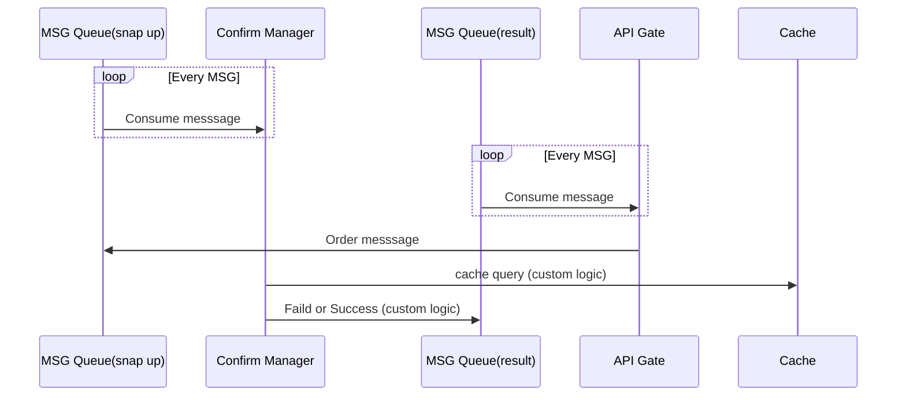
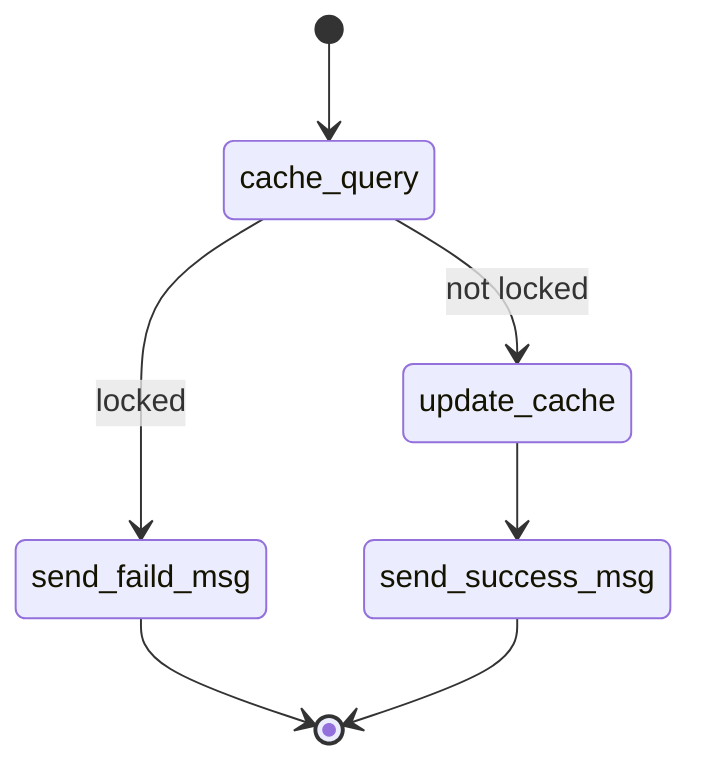
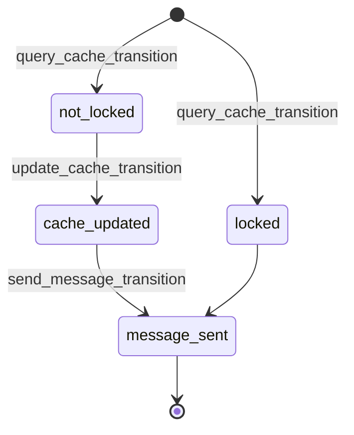
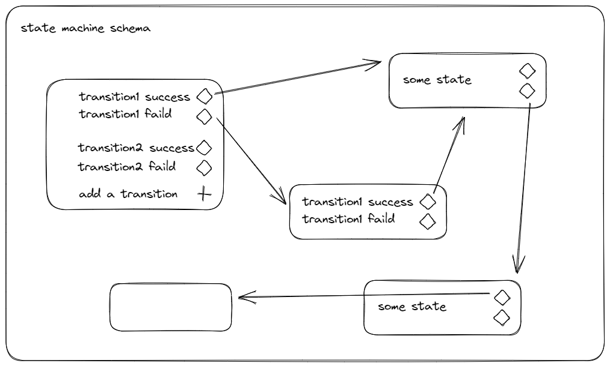

# 🤔 What is Ponder?

Ponder aim to Be A FSM-based programming Framework

## 🚀 Quick Start

## 🥸 Why Use Ponder?

✅ Focus on state
✅ Logic is easy to reuse
✅ Scalability

## 📓 A Confirm Manager



### How Confirm Manager Work

The following diagram defines how the Confirm Manager works.

When a message is received, the Confirm Manager performs the query action.

If it is already locked, send a confirmation failure message.

If not locked, lock it and send a success message.



### Confirm Manager's State

Using ponder define the Confirm Manager.

- First define all states.

  > Start , not_locked, locked, cache_updated, message_sent

- Then define the transitions.

  > query_cache_transition, update_cache_transition, send_message_transition,



---

## 🔑 How Ponder Work?



### Schema

A collection that stores state machine data

```ts
export interface ISchema {
  states: Record<string, IState>;
  transitions: Record<string, ITransition>;
  actions: Record<string, IAction>;
}
```

### State

Defines the state, including transitions

```ts
export interface IState {
  id: string;
  name: string;
  transitions: string[];
}
```

### Transition

Describes how to get from one state to the next.

```ts
export interface ITransition {
  id: string;
  from: string;
  faild: string;
  success: string;
  action: string;
}
```

### Action

Defines scripts that need to be executed during a transformation

```ts
export interface IAction {
  id: string;
  url?: string;
  content?: string;
}
```
