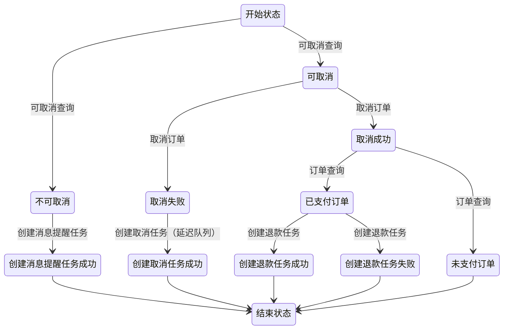

```mermaid
stateDiagram-v2
  开始状态 --> 可取消:可取消查询
  开始状态 --> 不可取消:可取消查询
  不可取消 --> 创建消息提醒任务成功: 创建消息提醒任务
  创建消息提醒任务成功 --> 结束状态
  可取消 --> 取消成功: 取消订单
  可取消 --> 取消失败: 取消订单
  取消失败 --> 创建取消任务成功: 创建取消任务（延迟队列）
  创建取消任务成功 --> 结束状态
  取消成功 --> 已支付订单: 订单查询
  已支付订单 --> 创建退款任务成功: 创建退款任务
  已支付订单 --> 创建退款任务失败: 创建退款任务
  创建退款任务成功 --> 结束状态
  创建退款任务失败 --> 结束状态
  取消成功 --> 未支付订单: 订单查询
  未支付订单 --> 结束状态
```
