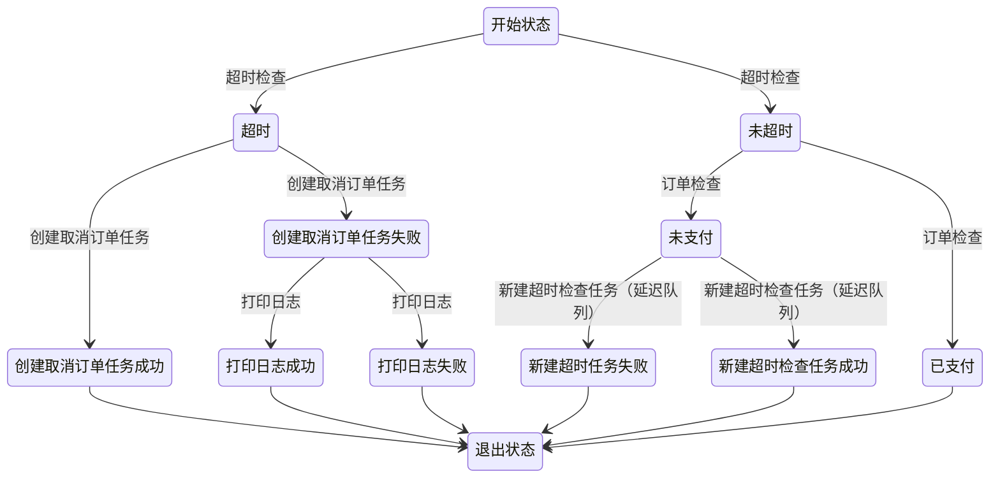

```mermaid
stateDiagram-v2
  开始状态 --> 超时: 超时检查
  超时 --> 创建取消订单任务成功:创建取消订单任务
  超时 --> 创建取消订单任务失败:创建取消订单任务
  创建取消订单任务成功 --> 退出状态
  创建取消订单任务失败 --> 打印日志成功:打印日志
  创建取消订单任务失败 --> 打印日志失败:打印日志
  打印日志成功 --> 退出状态
  打印日志失败 --> 退出状态
  开始状态 --> 未超时:超时检查
  未超时 --> 已支付:订单检查
  未超时 --> 未支付:订单检查
  未支付 --> 新建超时检查任务成功:新建超时检查任务（延迟队列）
  未支付 --> 新建超时任务失败:新建超时检查任务（延迟队列）
  新建超时任务失败 --> 退出状态
  新建超时检查任务成功 --> 退出状态
  已支付 --> 退出状态
```
